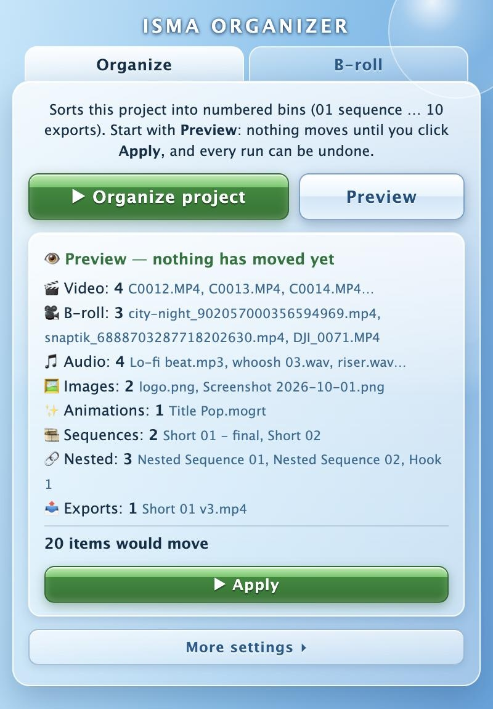

# Isma Organizer

A free panel for **Adobe Premiere Pro**. One click sorts your project into
numbered bins, and the B-roll you saved from Pinterest is one drag away from
your timeline.



*Preview on a demo project: nothing moves until you click Apply.*

## What it does

**Organize tab**

- Sorts what is new in the project into numbered bins: `01 sequence`,
  `02 video`, `03 b-roll`, `04 music & sound effect` (split into Music, SFX
  and Voice), `05 images`, `06 animations & templates`, `07 styles`,
  `08 nested sequence`, `09 other`, `10 exports`, and `00 offline` for media
  whose file is gone. Media on a drive that is only unplugged stays where it
  is.
- Tells nested sequences from your edits: a sequence used inside another
  timeline, or named "Nested Sequence…", goes to `08`. You can add your own
  words for both ("Hook", "Body"…).
- Recognizes B-roll by name and folder: Pinterest and TikTok downloads, stock
  sites, DJI, GoPro and Osmo files, any folder called "B-roll".
- Never touches the bins you made yourself. Every run can be undone.
- **Preview** shows what would move, and moves nothing.

**B-roll tab**

- Shows the videos and images you saved, newest first. Click one to see it
  large, drag it onto the timeline or into a bin.
- **Pinterest**: search Pinterest videos from the panel and save one with a
  click. Videos go to the panel's own folder, out of your Downloads; the
  **Folder** button opens it.

## Install

You need Premiere Pro 2022 or later, on Mac or Windows.

1. Download this repository: green **Code** button, then **Download ZIP**.
   Unzip it.
2. Quit Premiere Pro.
3. Run the installer for your computer, from the unzipped folder:
   - **Mac**: double-click `Install-Mac.command`.
   - **Windows**: double-click `Install-Windows.bat`.
4. Open Premiere Pro, then **Window > Extensions > Isma Organizer**.

The installer copies the panel into Adobe's extensions folder for your user
and lets Premiere load panels that are not signed (`PlayerDebugMode`), which
every panel installed outside Adobe's marketplace needs. No admin password.

### If the installer is blocked

The installer is not signed, so your system may stop it the first time.

- **Mac, "cannot be opened" or "Apple could not verify…"**: click **Done**,
  open **System Settings > Privacy & Security**, scroll down and click
  **Open Anyway** next to `Install-Mac.command`. On macOS 14 and older,
  right-click the file and choose **Open** instead.
  Or open Terminal, type `bash ` (with a space), drag `Install-Mac.command`
  into the window and press Enter.
- **Windows, "Windows protected your PC"**: click **More info**, then
  **Run anyway**. To avoid it, before unzipping: right-click the ZIP,
  **Properties**, tick **Unblock**, **OK**, then **Extract All**.

### ffmpeg, to save Pinterest videos

Most Pinterest videos come as separate picture and sound files. The panel joins
them with [ffmpeg](https://ffmpeg.org), which you install once:

- Mac, with [Homebrew](https://brew.sh): `brew install ffmpeg`
- Windows: `winget install -e --id Gyan.FFmpeg`
- Or put an `ffmpeg` program (`ffmpeg.exe` on Windows) in
  `PremiereProOrganizer/bin/` before running the installer.

Restart Premiere afterwards. Without ffmpeg, everything else works:
organizing, and browsing and dragging the videos already in your B-roll folder.

## Using it

- **Organize project**: files what is new, at the root of the project and on
  top of the numbered bins.
- **Undo last organize**: puts every moved item back where it was.
- **More settings**:
  - *Automatic*: file new sequences as they appear (a Nest goes to `08` within
    seconds), organize on a timer, when a project opens or after an import.
    All off until you turn them on.
  - *Sorting rules*: words that make a sequence always a main one (`01`) or
    always nested (`08`), words for B-roll, SFX and voice, an Ignore list, and
    whether clips get a label color.
  - *Bin names*: rename any of the numbered bins.
  - *B-roll*: the B-roll folder, and **Auto-import**: whatever lands in that
    folder is imported into the open project and filed in `03 b-roll`.
  - *Whole project — careful*: **Re-sort every bin** (also opens your own
    bins) and **Flatten project** (everything back to the root). Both ask
    twice and can be undone.

## What it writes on your computer

No account, no tracking. Nothing leaves your computer except the Pinterest
searches and downloads you ask for, which go to Pinterest.

| | Mac | Windows |
|---|---|---|
| Settings | `~/Library/Application Support/IsmaOrganizer/` | `%APPDATA%\IsmaOrganizer\` |
| Log of the last runs | `~/Library/Logs/IsmaOrganizer/` | `%LOCALAPPDATA%\IsmaOrganizer\Logs\` |
| Videos you save from Pinterest | `~/Library/Application Support/IsmaOrganizer/B-roll/` | `%LOCALAPPDATA%\IsmaOrganizer\B-roll\` |
| B-roll thumbnails | `~/Library/Caches/PinterestBroll/` | `%LOCALAPPDATA%\IsmaOrganizer\BrollThumbs\` |

On a Mac, the option **Red Finder tag** (off by default) adds a red tag to the
files in your B-roll folder.

The Pinterest search uses the same public web address as the Pinterest website.
Pinterest can change it at any time; if searching stops working, the rest of
the panel is not affected.

## Compatibility

- Premiere Pro 2022 to 2026 (CEP 11 and 12). Made and tested on Premiere Pro
  2026 on macOS. Windows and versions before 2026 are supported by design but
  not tested on a real machine yet: if something breaks, please
  [open an issue](../../issues).
- Adobe is moving Premiere panels from CEP, the technology this panel uses, to
  UXP, and has announced that CEP will be removed from a future version. This
  panel will need a rewrite then.

## Uninstall

Quit Premiere Pro and delete the `PremiereProOrganizer` folder:

- Mac: `~/Library/Application Support/Adobe/CEP/extensions/PremiereProOrganizer`
- Windows: `%APPDATA%\Adobe\CEP\extensions\PremiereProOrganizer`

The videos you saved stay in the folder listed above ("Videos you save from
Pinterest"). Delete it too only if no project uses them any more.

## For developers

- `PremiereProOrganizer/` is the extension. `index.html` holds both tabs;
  `OrganizeFilesInProject.jsx` and `ImportBroll.jsx` run inside Premiere
  (ExtendScript); `PinterestClient.js` talks to Pinterest; `tag-broll.py` sets
  the Finder tags.
- Tests need Node 18 or later and run without Premiere, against a fake project:

  ```bash
  cd PremiereProOrganizer && for t in tests/*.mjs; do node "$t" || exit 1; done
  ```

- Design notes: `PremiereProOrganizer/bridge-notes.md` (Organize) and
  `PremiereProOrganizer/broll-notes.md` (B-roll).

## En français

Panneau gratuit pour Premiere Pro. **Organize** range le projet en chutiers
numérotés en un clic (les séquences imbriquées à part, tout est annulable).
**B-roll** affiche tes vidéos Pinterest enregistrées : clic pour voir en grand,
glisser sur la timeline.

Installation : **Code > Download ZIP**, décompresse, quitte Premiere,
double-clique `Install-Mac.command` ou `Install-Windows.bat`, puis dans
Premiere : **Fenêtre > Extensions > Isma Organizer**. Si le Mac bloque
l'installateur : **Réglages Système > Confidentialité et sécurité > Ouvrir
quand même**. Pour enregistrer les vidéos Pinterest, installe ffmpeg
(`brew install ffmpeg` sur Mac, `winget install -e --id Gyan.FFmpeg` sur
Windows).

## License

MIT, see [LICENSE](LICENSE). `PremiereProOrganizer/CSInterface.js` is Adobe's
library for panels, distributed under Adobe's own terms.
